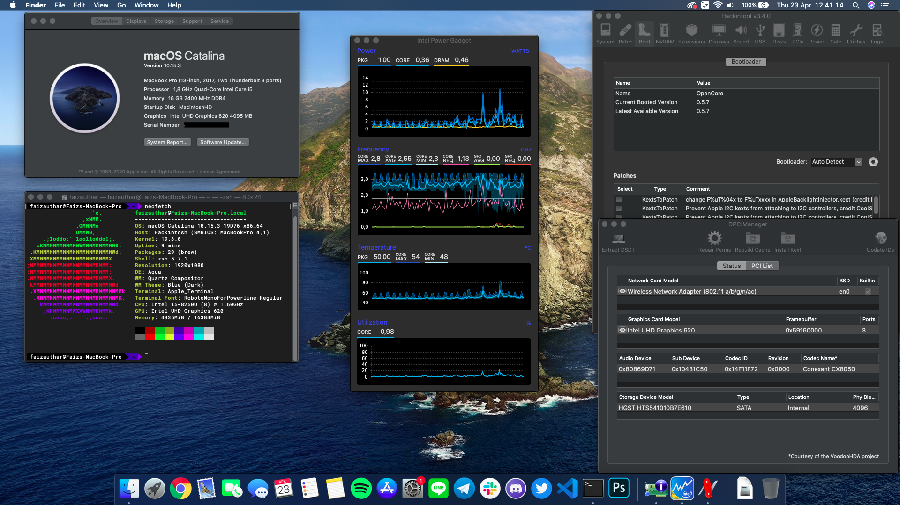
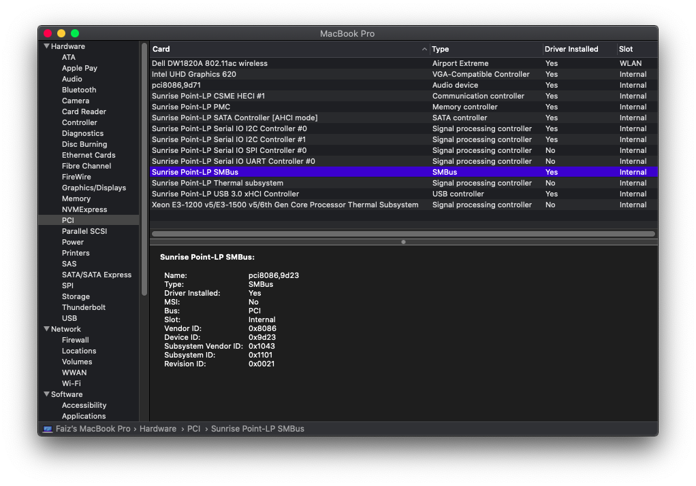

# OpenCore Configuration for ASUS A411UF / X411UF

## Spec Sheet
| Part        | Specs                            |
|-------------|----------------------------------|
| CPU         | i5-8250U                         |
| RAM         | 16GB(1 free slot,1 onboard)      |
| iGPU        | Intel UHD 620                    |
| dGPU        | Nvidia MX130 (disabled)          |
| WiFi        | QCA9377 ( replaced with DW1820A) |
| Audio       | Conexant CX8050 Layout-id 13     |
| HDD         | HGST HTS541010B7E610 (1TB)       |
| SSD         | unused slot                      |
| Touchpad    | ELAN1300                         |
| Fingerprint | ELAN1300(unused)                 |
| SDCard      | unused                           |
| Screen      | 1366x768(replaced with 1920x1080)|

## Working
1. QE/CI
2. All USB
3. Wireless AC
4. Bluetooth
5. Touchpad
6. Sleep
7. Power Management
8. Appstore, iMessage, FaceTime

## Not Working 
1. QCA9377
2. Realtek SD Card
3. Fingerprint reader
4. HDMI

## References
1. [Dortania's guide](https://github.com/dortania/vanilla-laptop-guide)
2. [toleda's wifi](https://github.com/toleda/wireless_half-mini)
3. [Herve's DW1820A guide](https://osxlatitude.com/forums/topic/11322-broadcom-bcm4350-cards-under-high-sierramojavecatalina/)
4. [cowcowpod's guide](https://www.tonymacx86.com/threads/guide-mojave-on-zenbook-s14-x411u-s410u.276311/)
5. [Hackintosh Reddit and Discord](https://reddit.com/r/hackintosh)
6. [hieplpvip's AsusSMC](https://github.com/hieplpvip/AsusSMC)
7. [acidanthera](https://github.com/acidanthera)

# Screenshots
## PCI Devices

  
PCI Devices

